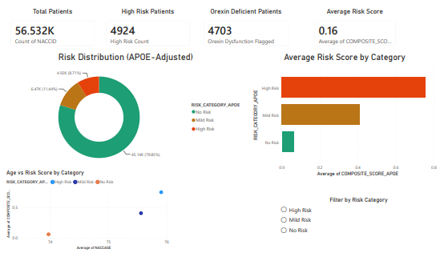
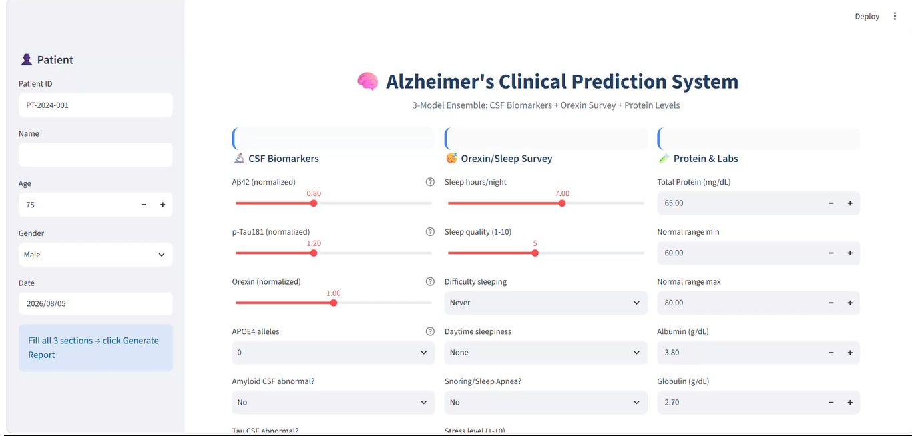
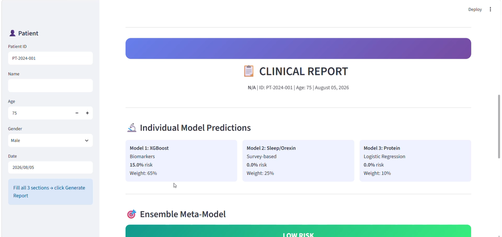
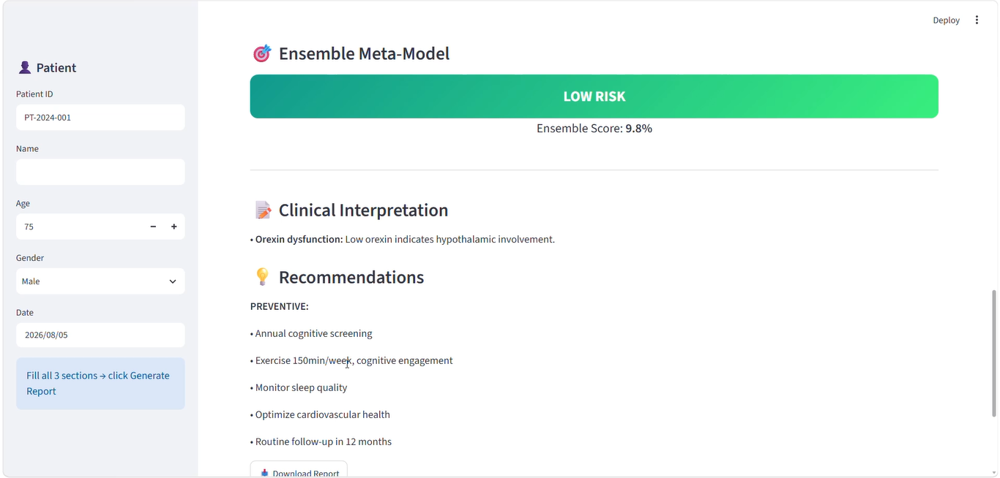

# Alzheimer's Disease Risk Stratification System

## 📊 Overview
A multivariate machine learning pipeline that stratifies Alzheimer's disease risk by combining **three independent data sources** into a weighted ensemble meta-model:

| Model | Data Source | Algorithm | Weight |
|-------|-------------|-----------|--------|
| Model 1 | CSF Biomarkers (Aβ42, p-Tau181, Orexin) | XGBoost | 65% |
| Model 2 | Sleep & Orexin Survey | Logistic Regression | 25% |
| Model 3 | Protein & Lab Results (Albumin) | Logistic Regression | 10% |

The ensemble score is validated against clinical standards (MMSE & CDRGLOB) and outperforms the MMSE baseline.

## 🛠️ Tools & Technologies
- **Python** — Pandas, NumPy, Scikit-learn, XGBoost, Matplotlib, Joblib
- **Power BI** — Executive clinical dashboard (data cleaned in Excel, loaded via Power BI)
- **Streamlit** — Deployed interactive clinical prediction web app
- **Excel** — Data preprocessing & cleaning for 56K+ row datasets

## 📈 Key Results
- **56,532** patient records analyzed (NACC dataset)
- **250** survey participants for sleep/orexin module
- Ensemble AUC: **~0.90** (95% bootstrap confidence interval)
- Outperformed MMSE baseline (standard of care) by **~5–10 percentage points**

## 🔬 ML Pipeline
The full end-to-end pipeline is available as a runnable Colab notebook:

📓 [`alzheimers_pipeline.ipynb`](alzheimers_pipeline.ipynb)

Includes:
- Data preprocessing & imputation
- 3 independent models with cross-validation
- Weighted ensemble meta-layer
- Bootstrap confidence intervals
- Validation against MMSE & CDRGLOB clinical benchmarks
- Feature importance analysis & ROC curves
- Model serialization for deployment

## 📸 Power BI Dashboard
### Patient Risk Overview

### Survey & Sleep Analytics

## 🖥️ Clinical Prediction App (Streamlit)
An interactive web app for real-time risk assessment:

**Patient Input Form**

**Generated Clinical Report**

**Ensemble Risk Score**

[📹 Watch Full Demo Video](app_demo.mp4)

## 📁 Files
| File | Description |
|------|-------------|
| `alzheimers_pipeline.ipynb` | Full ML pipeline — preprocessing, 3 models, ensemble, validation, visualization |
| `alzheimer_dashboard.pdf` | Power BI dashboard (4 pages: risk distribution, survey analytics, biomarker trends, cognitive scores) |
| `app_demo.mp4` | Streamlit app walkthrough — input form, ensemble prediction, clinical report generation |
| `*.png` | Screenshots of dashboard and app |

## 🔗 Connect With Me
[LinkedIn](https://linkedin.com/in/oshas-shahid)
